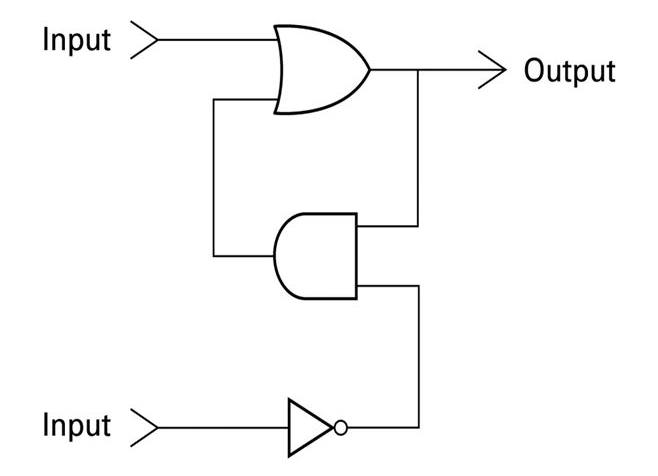

# Computer Science: An Overview
---
## 第1章 第1節 第2題 (P.37)
---
題目：  
In the text, we claimed that placing 1 on the lower input of the flip-flop in Figure 1.3 (while holding the upper input at 0) will force the flip-flop's output to be 0. Describe the sequence of events that occurs within the flip-flop in this case.  
  
答案：  
當 lower input 為 1，經過 NOT gate 成為 0。  
NOT gate = 0 進入中間 AND gate 使之總是輸出 0。  
AND gate = 0 進入上方 OR gate 使輸出等於 upper input。  
因此 output 取決於 upper input。  
題目指出 upper input 為 0，因此輸出為 0。 