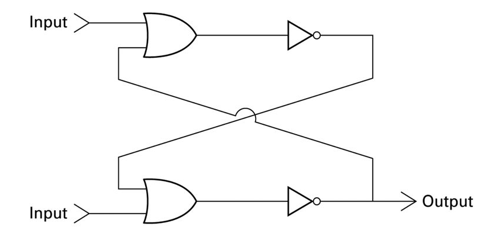

# Computer Science: An Overview
## 第1章 第1節 第3題 (P.38)
題目：  
Assuming that both inputs to the flip-flop in Figure 1.5 are 0, describe the sequence of events that occurs when the upper input is temporarily set to 1.  
  
答案：  
upper input = 0，使上方 OR gate 為 0 （另一端無輸入，為 0）。  
上方 OR gate 經過 NOT gate 成為 1。  
lower input = 0，上方 NOT gate = 1，經過下方 OR gate 成為 1。  
下方 OR gate 經過 NOT gate 為 0，輸出為 0。    