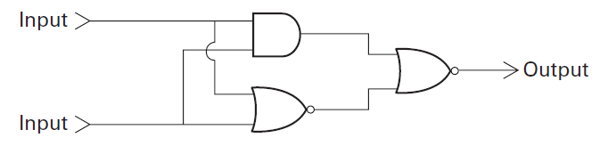

# Computer Science: An Overview
## 第1章 第1節 第4題 (P.38)
題目 a：  
If the output of an AND gate is passed through a NOT gate, the combination computes the Boolean operation called NAND, which has an output of 0 only when both its inputs are 1. The symbol for a NAND gate is the same as an AND gate except that it has a circle at its output. The following is a circuit containing a NAND gate. What Boolean operation does the circuit compute?  
  
答案：  
<table>
  <tr>
    <th>inputA</th>
    <th>inputB</th>
    <th>output</th>
  </tr>
  <tr>
    <td>0</td>
    <td>0</td>
    <td>0</td>
  </tr>
  <tr>
    <td>1</td>
    <td>0</td>
    <td>1</td>
  </tr>
  <tr>
    <td>0</td>
    <td>1</td>
    <td>1</td>
  </tr>
  <tr>
    <td>1</td>
    <td>1</td>
    <td>1</td>
  </tr>
</table>

題目 b：  
If the output of an OR gate is passed through a NOT gate, the combination computes the Boolean operation called NOR that has an output of 1 only when both its inputs are 0. The symbol for a NOR gate is the same as an OR gate except that it has a circle at its output. The following is a circuit containing an AND gate and two NOR gates. What Boolean operation does the circuit compute?   
  
答案：
<table>
  <tr>
    <th>inputA</th>
    <th>inputB</th>
    <th>output</th>
  </tr>
  <tr>
    <td>0</td>
    <td>0</td>
    <td>0</td>
  </tr>
  <tr>
    <td>1</td>
    <td>0</td>
    <td>1</td>
  </tr>
  <tr>
    <td>0</td>
    <td>1</td>
    <td>1</td>
  </tr>
  <tr>
    <td>1</td>
    <td>1</td>
    <td>0</td>
  </tr>
</table>
